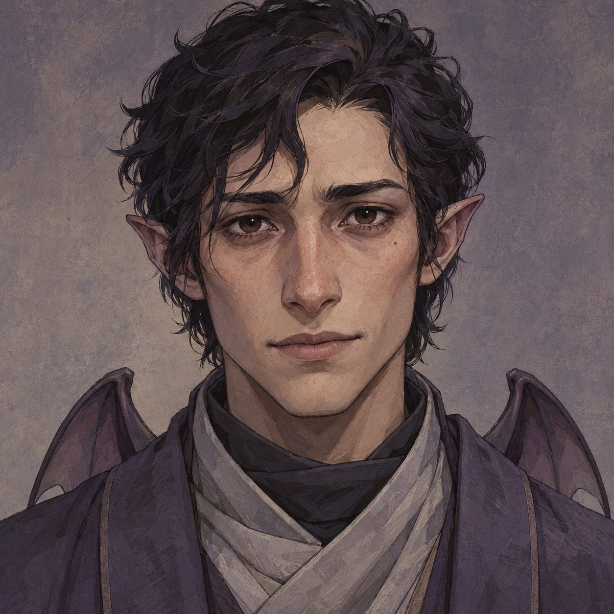
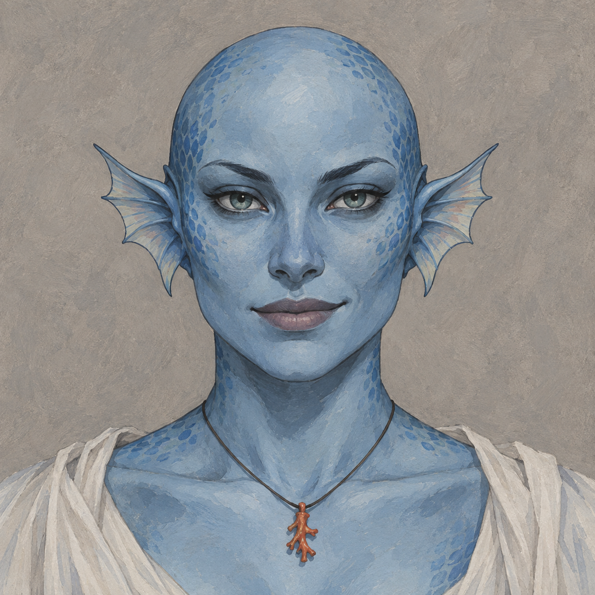
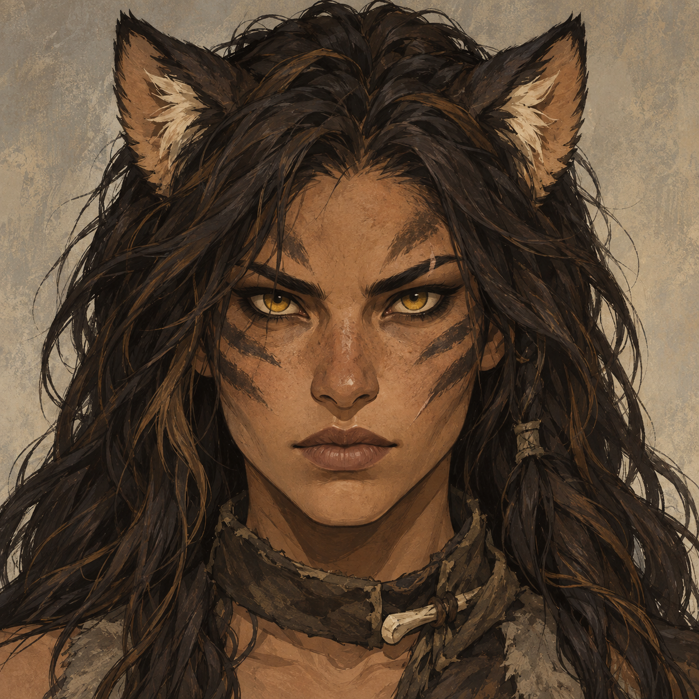
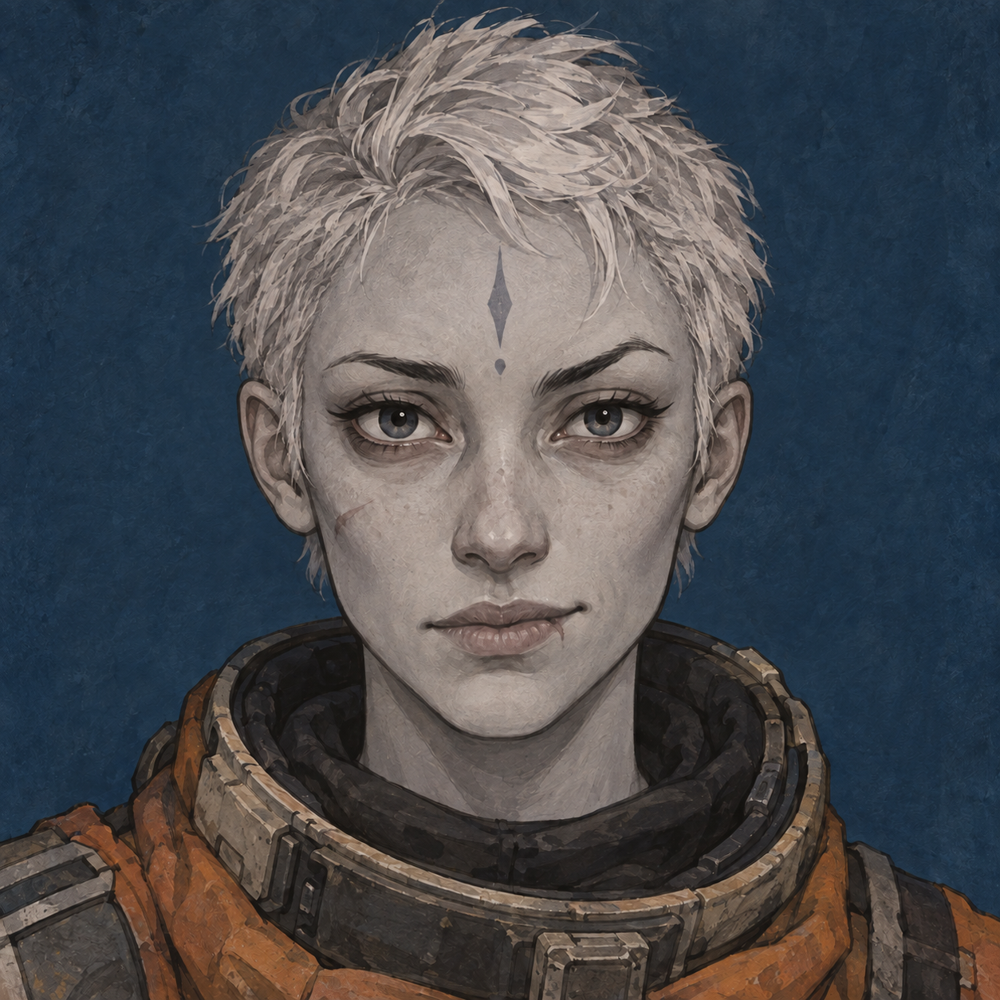
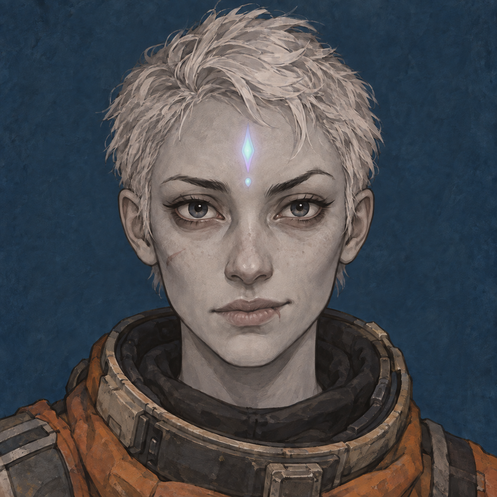

# Xyl's Xenotypes - concept portraits

Eleven face-on character portraits based on [the mod README](../../../../XylXenos/README.md). Ink-and-gouache illustration direction, generated with the built-in imagegen tool. Scaleborn is represented by the red lineage.

[Prompt development and final prompts](PROMPTS.md)

| | | |
| --- | --- | --- |
| **Bossaps**  | **Chyrr**  | **Dvergr**  |
| **Nixie**  | **Titan**  | **Trog**  |
| **Warcat**  | **Zeegee**  | **Omegabeaver**  |
| **Scaleborn — red lineage**  | **Succuboid**  |  |

## Zeegee variant

Pastel mint and lavender forehead mark with a soft glow, representing an inherent connection with technology.

[Original Zeegee](zeegee.png)

## Zeegee - technological mark

Pastel luminous traces, segmented bars and small nodes integrated into the forehead.

