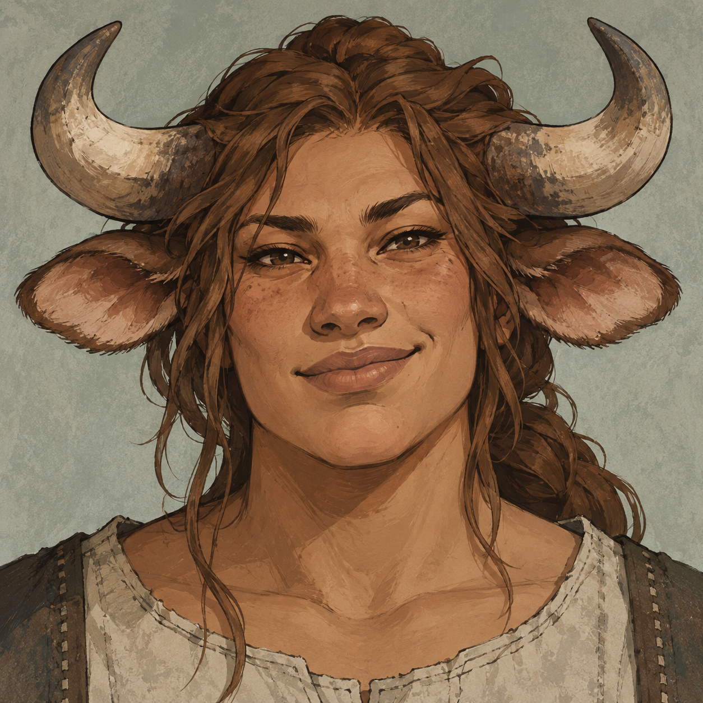
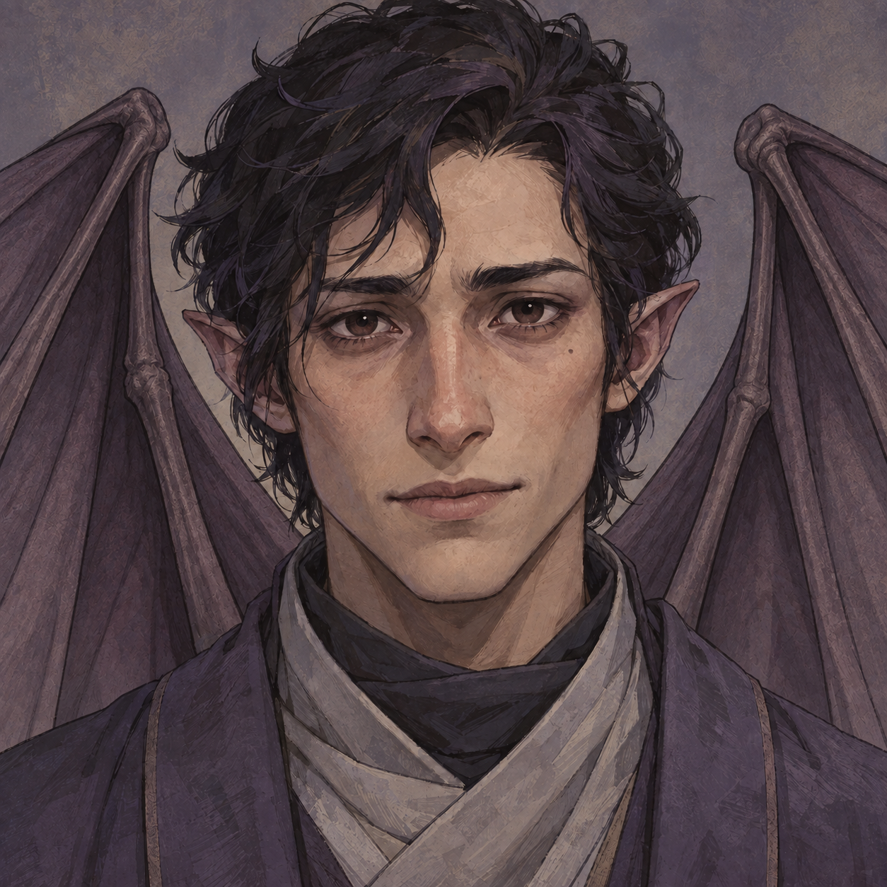
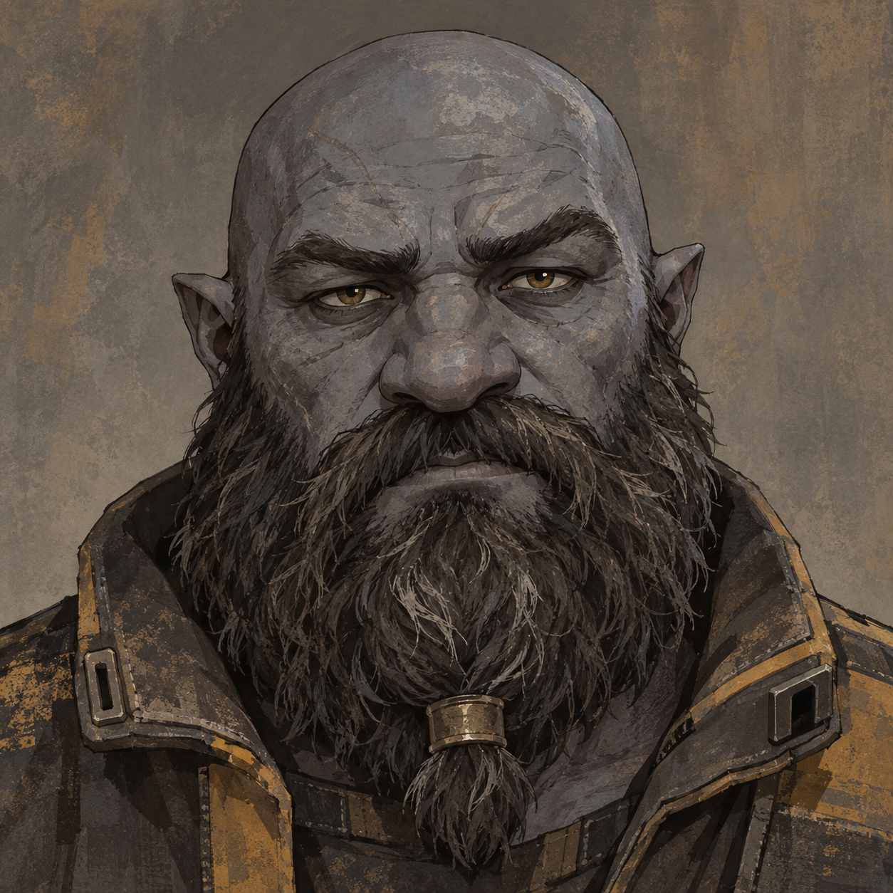
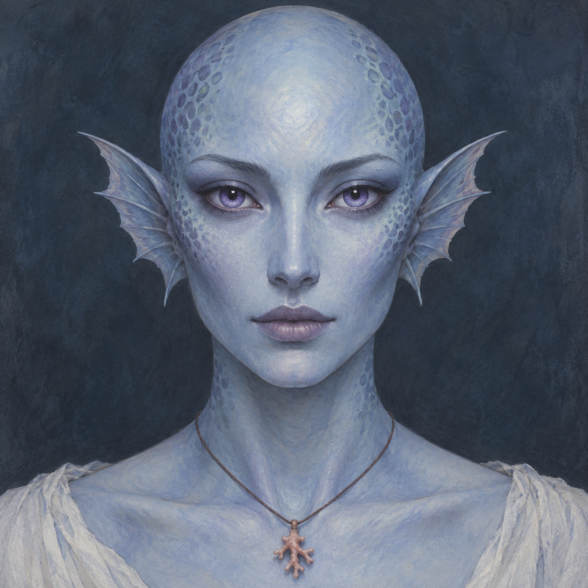
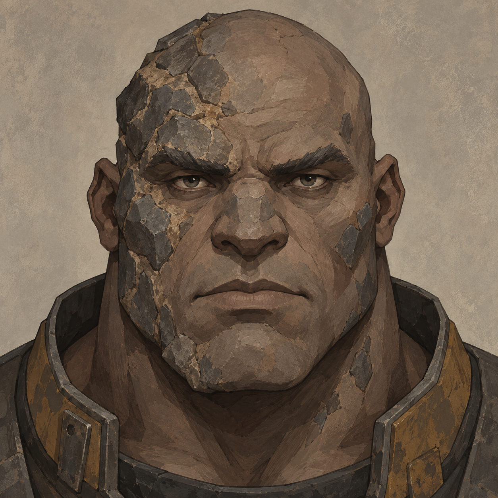
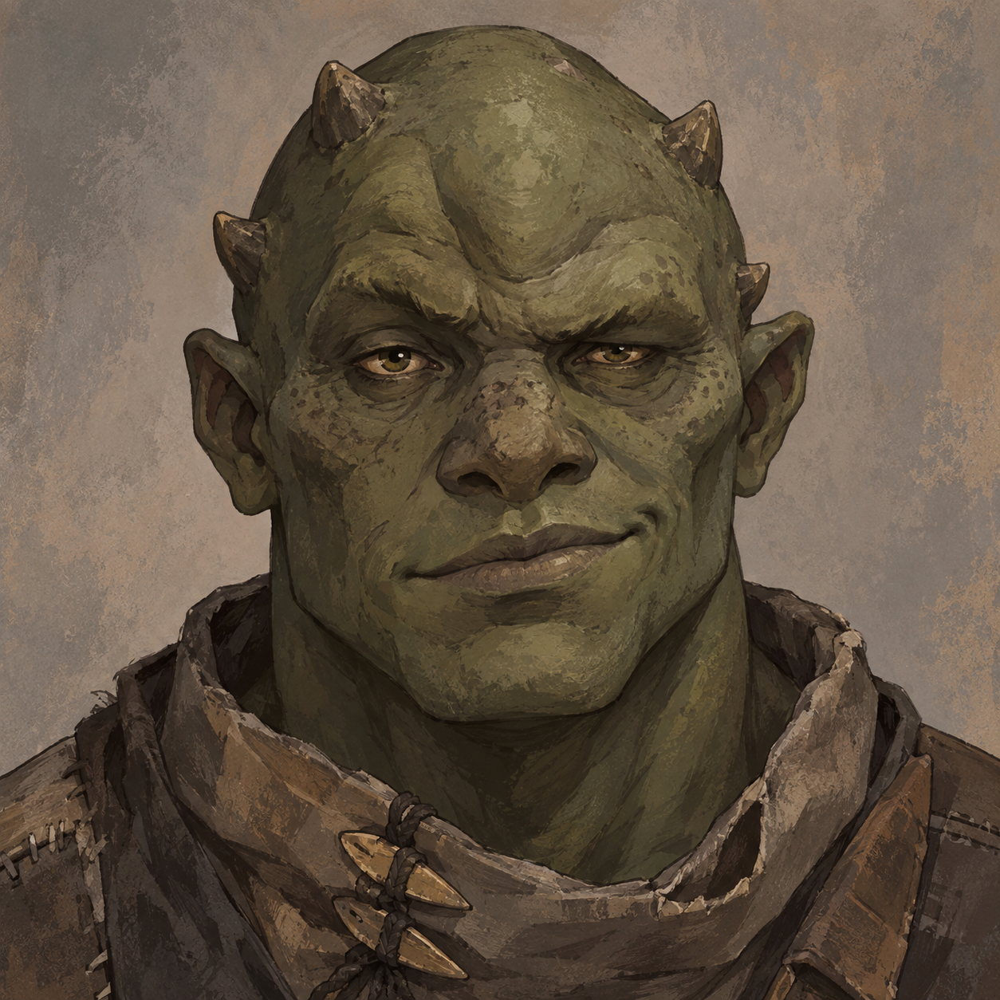
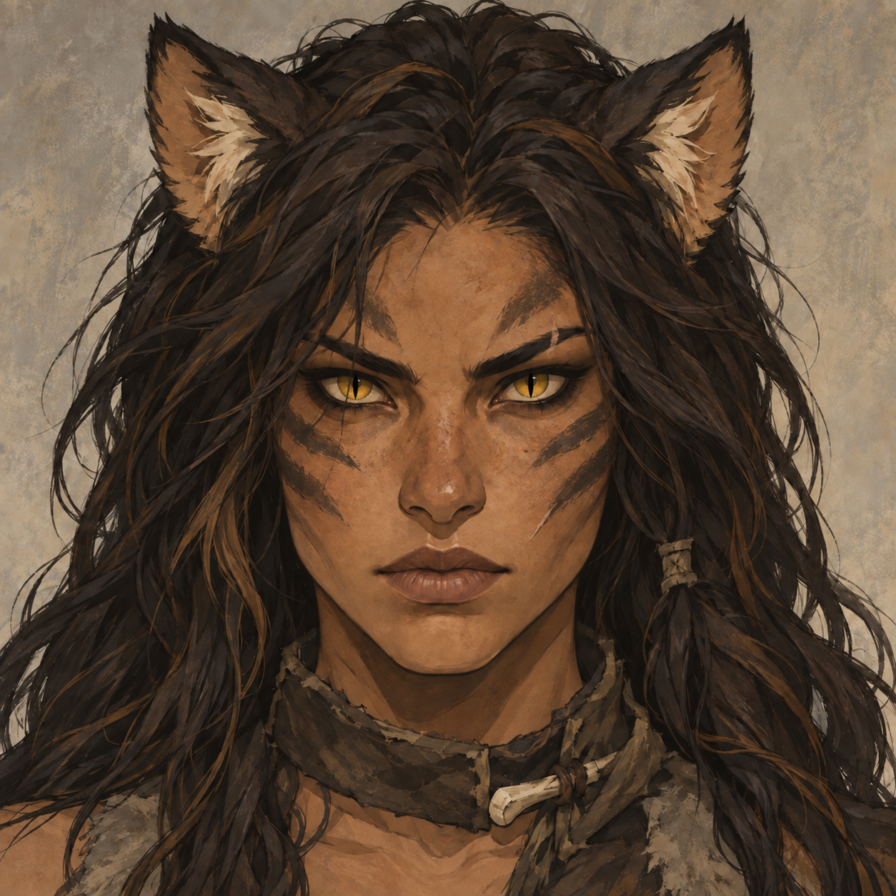
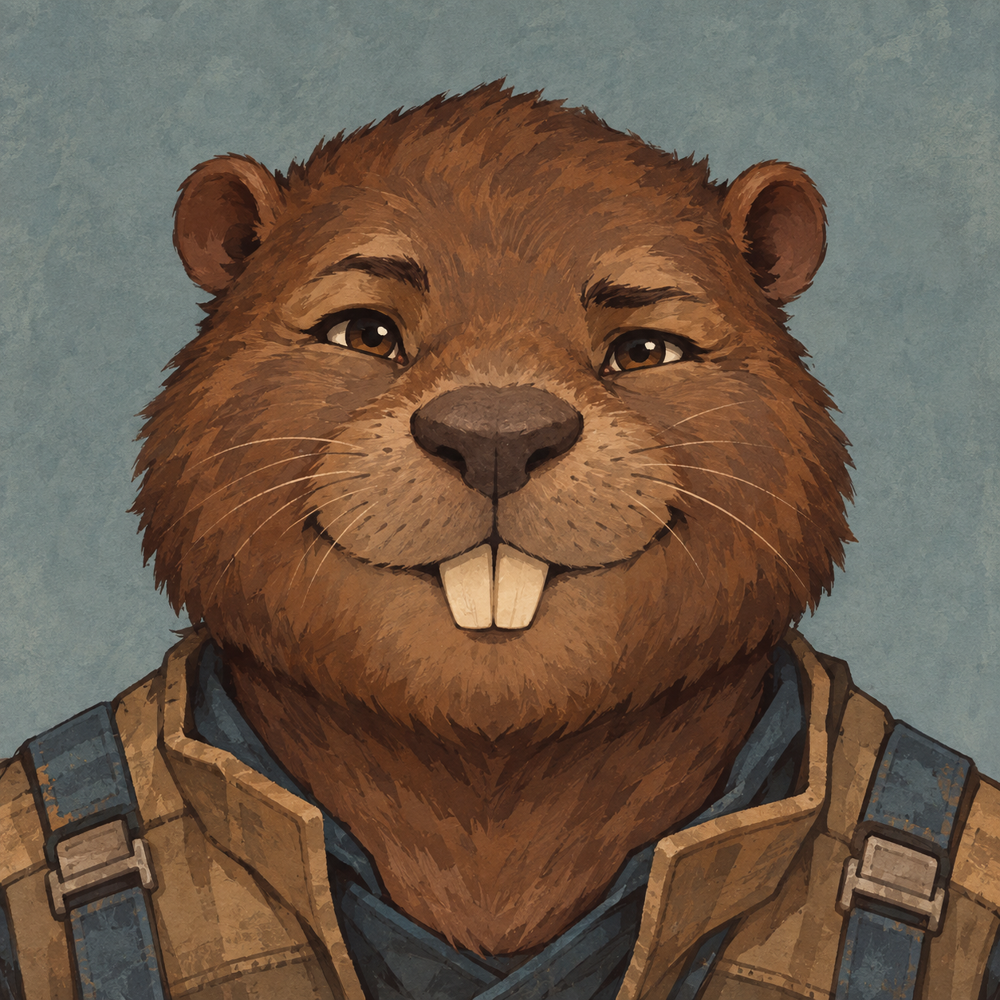
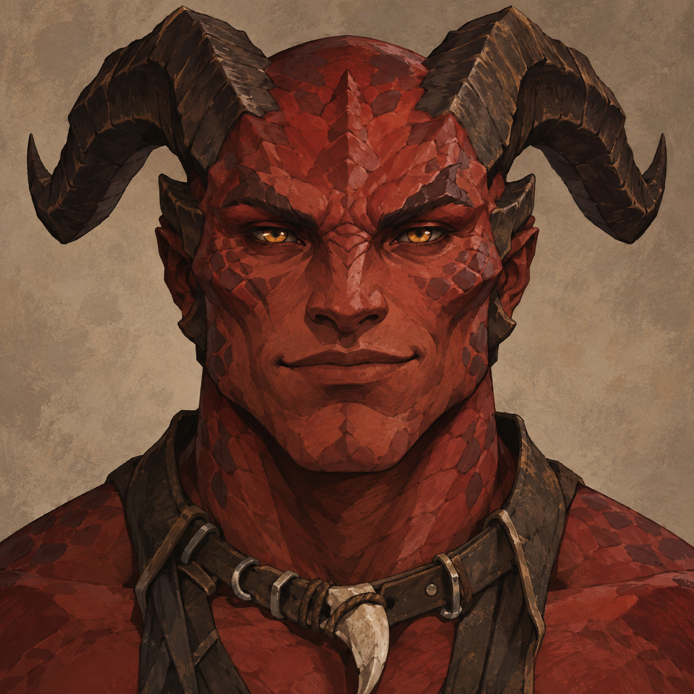
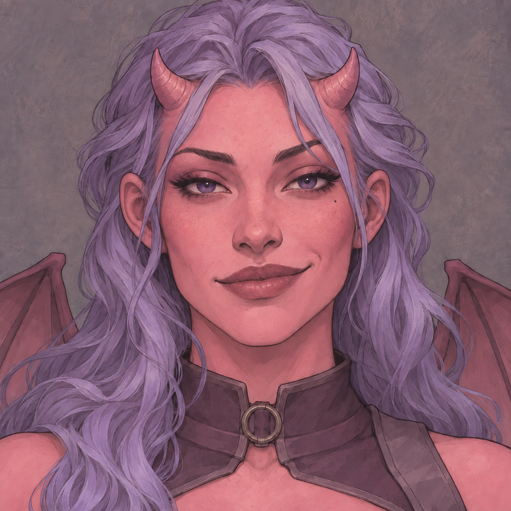

# Xyl's Xenotypes - concept portraits

Eleven face-on character portraits based on [the mod README](../../../../XylXenos/README.md). Ink-and-gouache illustration direction, generated with the built-in imagegen tool. Scaleborn is represented by the red lineage.

[Prompt development and final prompts](PROMPTS.md)

| | | |
| --- | --- | --- |
| **Bossaps**  | **Chyrr**  | **Dvergr**  |
| **Nixie**  | **Titan**  | **Trog**  |
| **Warcat**  | **Zeegee**  | **Omegabeaver**  |
| **Scaleborn — red lineage**  | **Succuboid**  |  |

## Second set - design revisions

Alternate interpretations responding to the critique, preserving the established characters where possible. The first set above is retained for comparison. Succuboid retains her youthful adult appearance, with visual aging stopped at 18.

[Design decisions and generation prompts](second-set/PROMPTS.md)

| | | |
| --- | --- | --- |
| **Bossaps**  | **Chyrr**  | **Dvergr**  |
| **Nixie**  | **Titan**  | **Trog**  |
| **Warcat**  | **Zeegee**  | **Omegabeaver**  |
| **Scaleborn — red lineage**  | **Succuboid**  |  |

