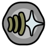
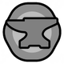
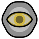
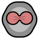

# Xyl's Xenotypes

Eleven xenotypes for RimWorld, from fungus-fed underground builders to vat-grown stone giants, aquatic traders, and descendants of generation-ship crews. Each brings its own needs, strengths, and complications to colony life.

**Requires RimWorld 1.6, Biotech, and Harmony.** Royalty adds innate psycasts; Ideology and Odyssey provide additional features where noted.

All xenotypes except titans are inheritable. The tables describe the mod's new functional and appearance genes; the lists below them include other existing genes and appearance options.

- [Bossaps](#bossaps)
- [Chyrr](#chyrr)
- [Dvergr](#dvergr)
- [Nixie](#nixie)
- [Titan](#titan)
- [Trog](#trog)
- [Warcat](#warcat)
- [Zeegee](#zeegee)
- [Omegabeaver](#omegabeaver)
- [Scaleborn](#scaleborn)
- [Succuboid](#succuboid)
- [Currently unused genes](#currently-unused-genes)

## Bossaps

Bossaps were created as sentient livestock by the gene-engineers of a glitterworld best forgotten. They gain extra nourishment from raw plants, and their mostly female herds produce abundant milk. Naturally gregarious, they become unhappy in small colonies but tolerate shared barracks. While usually docile, injury can send a bossaps charging horns-first in an uncontrollable rage - even at the friend whose shot went astray.

The glitterworld that created bossaps had a strict vegan philosophy that it was unethical to keep animals that couldn’t consent to their own treatment. Their solution was to engineer livestock that not only consented to being owned, but did so enthusiastically. Long after the fall of their birthplace, wild bossaps herds can be found on many rimworlds.

### Trivia

"Bossaps" is a contraction of "Bos sapiens", a fictional scientific name that means "Wise cow".

### Genes

| Icon | Gene | Effect |
| --- | --- | --- |
|  | [Herd instinct](Defs/GeneDefs/GeneDefs_Mood.xml) | Carriers of this gene need the comfort of being in a large group. They get a mood penalty if there are too few members of the colony. They also don't mind sleeping in a barracks. |
|  | [Docile](Defs/GeneDefs/GeneDefs_Miscellaneous.xml) | Carriers of this gene are generally docile. They are easy to enslave and rarely rebel. They also never start social fights. |
|  | [Large horns](Defs/GeneDefs/GeneDefs_InnateWeapons.xml) | Carriers of this gene have large horns that function as a weapon. |
|  | [Seeing red](Defs/GeneDefs/GeneDefs_Miscellaneous.xml) | Carriers of this gene have a chance of going into a blind range when they are damaged in combat, charging the nearest enemy and fighting in melee until all enemies are dead. During this state they are faster, stronger, and nearly immune to pain. This ability can't be controlled. |
|  | [Pain reversal](Defs/GeneDefs/GeneDefs_Traits.xml) | Carriers of this gene have scrambled senses that make them feel pain as pleasurable. |
|  | [Hyperlactation](Defs/GeneDefs/GeneDefs_Hyperlactation.xml) | Female carriers of this gene produce large amounts of breast milk, and lactate even when not pregnant or breastfeeding. This gene is inactive on males. |
|  | [Usually female](Defs/GeneDefs/GeneDefs_Reproduction.xml) | Carriers of this gene are mostly female.  This gene has no effect unless it is a germline gene. |
|  | [Herbivore stomach](Defs/GeneDefs/GeneDefs_Diet.xml) | Carriers of this gene have specialized stomachs that can extract more nutrition from raw plant-based foods, but are poor at digesting meat. They never get negative thoughts from eating plant-based foods. |

**Appearance genes**

| Icon | Gene |
| --- | --- |
|  | [Cow ears](Defs/GeneDefs/GeneDefs_Cosmetic.xml) |

**Other genes and appearance**

- **Traits:** cold tolerant, heat tolerant, robust, fertile, nearsighted.
- **Skills:** poor cooking aptitude, strong plants aptitude.
- **Appearance:** long hair, standard body, fat body, hulk body.

## Chyrr

Chyrr are batlike xenohumans who trace their origin to a legendary blind healer. They have a strong aptitude for medicine, and their echolocation and keen hearing let them “see” using sound as well as vision. Their bodies are easily injured, but they can stun living enemies with a cry of ultrasound and psychic energy, then take flight on membranous wings for a short escape. In colder weather, they naturally enter a state of hibernation, leaving them protected from hypothermia and frostbite but otherwise helpless.

According to chyrr myth, a blind woman named Marah came across an injured stranger. She brought the stranger back to her tribe and spent many moons nursing him back to health. As a parting gift, the stranger transformed Marah and her tribe into chyrr.

### Trivia

"Chyrr" is a corruption of "chiropteran", the scientific name for bats, which comes from the roots *chiro* "hand" and *ptera* "wing".

### Genes

| Icon | Gene | Effect |
| --- | --- | --- |
|  | [Sonic wave](Defs/GeneDefs/GeneDefs_Abilities.xml) | Carriers of this gene are able to release a wave of high-intensity ultrasonic noise and psychic energy at a target. The noise will stun any non-mechanoid creature nearby. |
|  | [Bat wings](Defs/GeneDefs/GeneDefs_Miscellaneous.xml) | Carriers of this gene have bat-like wings, allowing them to fly for short periods. Wearing some heavy torso-covering items will prevent flight. |
|  | [Torpor](Defs/GeneDefs/GeneDefs_Miscellaneous.xml) | The body of a carrier of this gene automatically goes into hibernation in cold temperatures. This will impair their capabilities and eventually cause unconsciousness. It also reduces food consumption and slows the progression of hypothermia and starvation. |
|  | [Nocturnal](Defs/GeneDefs/GeneDefs_Traits.xml) | Carriers of this gene are naturally active at night. |
|  | [Keen ears](Defs/GeneDefs/GeneDefs_Senses.xml) | Carriers of this gene have improved hearing. |
|  | [Echolocation](Defs/GeneDefs/GeneDefs_Senses.xml) | Carriers of this gene can use high-frequency sound waves to "see" with their ears instead of their eyes. |

**Appearance genes**

| Icon | Gene |
| --- | --- |
|  | [Small pointed ears](Defs/GeneDefs/GeneDefs_Cosmetic.xml) |

**Other genes and appearance**

- **Traits:** weak immunity, cold sensitive, heat tolerant, mild UV sensitivity, delicate, dark vision.
- **Skills:** poor mining aptitude, strong medicine aptitude.
- **Appearance:** standard body, thin body, no beard.

## Dvergr

Dvergr hail from the vast underground cities beneath the inhospitable surface of the mineral world Svartalfheim. They see in darkness, tolerate great heat, and never need to go outdoors. They are fast workers and skilled miners, builders, and craftspeople. Their stomachs extract extra nourishment from raw fungus, although they hate the taste. They are both culturally and metabolically dependent on regular alcohol consumption, and going without it leads to illness and eventually death.

Dvergr society is organized around the clan and the corporation; the two are one and the same. They are renowned for their skill with explosives, deep understanding of geology, excellent legal departments, and remarkably short safety manuals.

### Trivia

"Dvergr" is an Old Norse word for dwarf, and their homeland in Old Norse mythology was either called "Svartálfheim" or "Niðavellir" depending on the source.

### Genes

| Icon | Gene | Effect |
| --- | --- | --- |
|  | [Stoic](Defs/GeneDefs/GeneDefs_Traits.xml) | Carriers of this gene are mentally tough and won't break down under stresses that would crack most people. |
|  | [Melancholy](Defs/GeneDefs/GeneDefs_Traits.xml) | Carriers of this gene always have the tortured artist trait, which gives them a permanent mood penalty but also grants a chance to gain creative inspiration after a mental break. |
|  | [Dwarf](Defs/GeneDefs/GeneDefs_Body.xml) | Carriers of this gene have smaller bodies with proportionately larger heads. Their short legs somewhat reduce their movement speed. |
|  | [Fungus eater](Defs/GeneDefs/GeneDefs_Diet.xml) | Carriers of this gene have special digestive enzymes that extract more nutrition from raw fungus - but they don't do anything about the taste. |
|  | [Industrious](Defs/GeneDefs/GeneDefs_Traits.xml) | Carriers of this gene are exceptionally fast workers. |

**Appearance genes**

| Icon | Gene |
| --- | --- |
|  | [Bald males](Defs/GeneDefs/GeneDefs_Hair.xml) |
|  | [Small pointed ears](Defs/GeneDefs/GeneDefs_Cosmetic.xml) |

**Other genes and appearance**

- **Traits:** psychically dull, very heat tolerant, aggressive, strong stomach, dark vision, cave dweller, unstoppable, alcohol dependency.
- **Skills:** strong construction aptitude, strong mining aptitude, strong crafting aptitude, poor medicine aptitude, poor social aptitude.
- **Appearance:** short hair, bushy beard, light gray skin, slate gray skin, ink-black skin.

## Nixie

Originally engineered for the water world of Atlantis, nixies have spread across inhabited space. Their scaled skin and webbed hands provide protection and let them move quickly in water, but long periods outside it will leave them miserable with cracked, bleeding skin. Beyond their physical adaptations, they possess otherworldly beauty and innate psychic powers that draw others towards them. They are skilled negotiators but poor miners and builders, trading with “dryskins” for manufactured goods.

The planet Atlantis is entirely covered by a shallow, planet-wide sea. Without access to dry land, nixies were unable to develop advanced technology and industry. Instead, they put their efforts into developing art and culture, creating beautiful coral gardens and ethereal songs that echo for miles underwater. The source of their psychic abilities is a mystery.

### Trivia

"Nixie" comes from the name of mythical water spirits from Germanic folklore that used their beauty and music to lure unsuspecting people into the water.

### Genes

| Icon | Gene | Effect |
| --- | --- | --- |
|  | [Beckon](Defs/GeneDefs/GeneTemplateDefs_Psycasts.xml) | The carrier automatically learns the beckon psycast, and can use it without a psylink.  Psychically command the target to approach the caster. |
|  | [Focus](Defs/GeneDefs/GeneTemplateDefs_Psycasts.xml) | The carrier automatically learns the focus psycast, and can use it without a psylink.  Psychically focus the target's mind, boosting their sight, hearing and moving capacities. |
|  | [Scaleskin](Defs/GeneDefs/GeneDefs_Body.xml) | Carriers of this gene grow tough but flexible scales all over their body that can deflect or absorb attacks. |
|  | [Drug sensitive](Defs/GeneDefs/GeneDefs_Drugs.xml) | Carriers of this gene are easily affected by drugs. Effects from a single dose last longer, they gain tolerance faster, and they are more likely to become addicted. |
|  | [Aquatic](Defs/GeneDefs/GeneDefs_Needs.xml) | Carriers of this gene have a need to periodically soak in water, and will become unhappy if they stay dry for too long. |

**Appearance genes**

| Icon | Gene |
| --- | --- |
|  | [Fin ears](Defs/GeneDefs/GeneDefs_Cosmetic.xml) |

**Other genes and appearance**

- **Traits:** enhanced psychic sensitivity, naked speed, webbed phalanges, pessimist (Royalty), very cold tolerant, heat sensitive, weak melee damage, pretty.
- **Skills:** poor mining aptitude, poor construction aptitude, strong social aptitude.
- **Appearance:** bald, snow-white hair, grayless hair, blue skin.

## Titan

Titans are mass-produced workers originally designed for reclaiming deathworlds. Specialized carbon-silicate lithoid biochemistry makes them immune to toxins and highly resistant to injury and disease, letting them work in conditions that would be lethal for other xenotypes. Each is engineered with exceptional aptitude and passion for one random skill, but they have great difficulty learning skills that they aren’t passionate about. Their unusual biochemistry also leaves them susceptible to petrification, an incurable genetic disease that gradually turns their tissues to solid stone.

Today, titans can be found on more than just the deathworlds they were engineered for. They are employed in space construction, mining, and agriculture, among other fields. Their employers are mostly well-resourced governments or corporations that are able to afford the expense of providing them with a regular supply of lithoid drugs such as softener and atlasite.

### Trivia

"Titan" comes from the name of godlike beings from Greek mythology. One well-known titan was Atlas, who held up the sky on his shoulders.

### Genes

| Icon | Gene | Effect |
| --- | --- | --- |
|  | [Rock toss](Defs/GeneDefs/GeneDefs_Abilities.xml) | The carrier can pick up a rock chunk in combat and toss it. It will land near a targeted location, damaging everything in a radius around where it lands. |
|  | [Lithoid](Defs/GeneDefs/GeneDefs_Drugs.xml) | Carriers of this gene have a unique biochemistry that incorporates carbon-silicates. They are completely unaffected by most drugs that work on baseliners, and instead must use specialized drugs designed for lithoids. |
|  | [Rockskin](Defs/GeneDefs/GeneDefs_Body.xml) | Carriers of this gene have extremely tough skin studded with rock-like plates that can deflect or absorb attacks. The inflexible skin reduces movement speed. |
|  | [Petrification](Defs/GeneDefs/GeneDefs_Petrification.xml) | Carriers of this gene have a chance to develop a disease named petrification. Petrification slowly replaces tissues throughout the body with stone. The disease is incurable, but progress can be slowed with medical treatment, and the affected tissues can be removed surgically. |
|  | [Focused](Defs/GeneDefs/GeneDefs_Miscellaneous.xml) | Carriers of this gene care deeply about subjects they are interested in. They learn faster for skills they have a burning passion in, but much slower at skills they have no passion in. |
|  | [Giant](Defs/GeneDefs/GeneDefs_Body.xml) | Carriers of this gene are exceptionally large. They can take more damage, carry more, and are more resistant to drugs and toxins, but are also easier to hit with ranged weapons. |
|  | [Joyless](Defs/GeneDefs/GeneDefs_Needs.xml) | Carriers of this gene are genetically incapable of feeling joy. They have no need for recreation, and get no mood bonuses or penalties from it. |
|  | [Super-specialist](Defs/GeneDefs/GeneDefs_BonusGenes.xml) | The carrier's aptitude in one random skill is increased by 8. Aptitude acts like an offset on skill level. Additionally, one level of passion is added to that skill. |

**Appearance genes**

| Icon | Gene |
| --- | --- |
|  | [Bald males](Defs/GeneDefs/GeneDefs_Hair.xml) |

**Other genes and appearance**

- **Traits:** strong melee damage, super immunity, slow wound healing, superclotting, psychically deaf, slow runner, total toxic resistance, sterile, ugly.
- **Skills:** poor social aptitude, poor intellectual aptitude.
- **Appearance:** no beard, hulk body.

**Lithoid drugs:** [Softener](Defs/Drugs/Drugs_Titan.xml) prevents petrification. Atlasite builds protective resistance with regular doses. Crystal improves performance and dulls pain, but is highly addictive.

## Trog

Trogs emerged from generations of interbreeding among wasters, dirtmoles, and neanderthals on the worst rimworlds known to mankind. They are ugly, slow, and poor learners, but skilled miners and animal handlers. They emit special pheromones that let them move freely among giant insects, and even tame them and employ them as war animals. Like wasters, pollution invigorates them, but they are only partially resistant to its effects. Roughly half inherit additional random genes from who-knows-where.

Trogs can be found anywhere other xenotypes don’t want to live, from polluted wastelands to underground caverns to volcanic lava fields. They form aggressive, territorial clans that often squabble as much among themselves as they do with outsiders. Despite their unwholesome reputation, they can be quite welcoming to outcast and shunned people of any xenotype.

### Trivia

"Trog" is an abbreviation of "troglodyte", meaning a person who lives in a cave.

### Genes

| Icon | Gene | Effect |
| --- | --- | --- |
|  | [Toxic burst](Defs/GeneDefs/GeneDefs_Abilities.xml) | Carriers have the ability to release a cloud of tox gas around them from a special gland located near their anus. The gas affects the user normally. |
|  | [Bio-rejection](Defs/GeneDefs/GeneDefs_Miscellaneous.xml) | Carriers of this gene have a severe allergic reaction to any sort of artificial implant or body part. They will suffer continual pain until the implant or part is removed. |
|  | [Insect pheromones](Defs/GeneDefs/GeneDefs_Miscellaneous.xml) | Carriers of this gene produce special pheromones which prevent wild insects from attacking them. This protection is briefly disabled if their faction provokes the insects. |
|  | [Drug resistant](Defs/GeneDefs/GeneDefs_Drugs.xml) | Carriers of this gene are less affected by drugs. Effects from a single dose wear off faster, they gain tolerance slower, and they are less likely to become addicted. |
|  | [Genetic atavism](Defs/GeneDefs/GeneDefs_BonusGenes.xml) | Carriers of this gene have an unstable genome that may have random extra genes. |

**Appearance genes**

| Icon | Gene |
| --- | --- |
|  | [Warped head](Defs/GeneDefs/GeneDefs_Cosmetic.xml) |
|  | [Dark green skin](Defs/GeneDefs/GeneDefs_SkinColors.xml) |
|  | [Olive skin](Defs/GeneDefs/GeneDefs_SkinColors.xml) |

**Other genes and appearance**

- **Traits:** strong immunity, slow runner, partial toxic-environment resistance, mild UV sensitivity, aggressive, strong melee damage, reduced pain, very ugly, slow study, dark vision, pollution rush, mild cell instability.
- **Skills:** strong mining aptitude, strong animals aptitude, terrible intellectual aptitude.
- **Appearance:** bald, human headbone, mini-horns, green skin.

## Warcat

Warcats were created in military gene-vats as experimental supersoldiers - part human, part great cat, all fast-twitch muscle. But something in the splice broke, leaving them dependent on a diet of raw meat to survive. Their descendants roam the rimworlds in packs, hunting with retractable claws, powerful melee attacks, and catlike reflexes.

Warcat tribes are a constant threat on the rim. Their need for meat drives them to hunt anything they can, even other xenohumans. Many warcat hunters carry the skulls of those they have eaten as trophies.

## Trivia

Real cats are unable to produce adequate amounts of certain essential nutrients such as taurine, and must get them from meat as part of their diet.

### Genes

| Icon | Gene | Effect |
| --- | --- | --- |
|  | [Feral rage](Defs/GeneDefs/GeneDefs_Abilities.xml) | Carriers have the ability to enter a state of feral rage, giving increased movement speed (+50%) and faster melee attacks (+50%). After the rage ends, there is a temporary backlash which causes pain (+10%) and slows movement (-20%). |
|  | [Moody](Defs/GeneDefs/GeneDefs_Mood.xml) | Carriers of this gene have a volatile emotional state. They randomly get good and bad moods. |
|  | [Fast reflexes](Defs/GeneDefs/GeneDefs_Traits.xml) | Carriers of this gene have excellent reflexes that allow them to dodge melee attacks and evade traps. |
|  | [Retractable claws](Defs/GeneDefs/GeneDefs_InnateWeapons.xml) | Carriers of this gene have retractable claws that function as weapons. |
|  | [Carnivore stomach](Defs/GeneDefs/GeneDefs_Diet.xml) | Carriers of this gene have specialized stomachs that can extract more nutrition from raw meat, but are poor at digesting plant-based foods. They never get negative thoughts from eating meat. |
|  | [Meat dependence](Defs/GeneDefs/GeneDefs_Diet.xml) | Carriers of this gene are unable to synthesize certain essential nutrients and must obtain them by eating raw meat. Without it, their health and mood will steadily decline, leading to pain, muscle weakness, mental instability, coma, and eventually death. |

**Appearance genes**

| Icon | Gene |
| --- | --- |
|  | [Yellow eyes](Defs/GeneDefs/GeneDefs_Cosmetic.xml) |
|  | [Facial stripes](Defs/GeneDefs/GeneDefs_Cosmetic.xml) |

**Other genes and appearance**

- **Traits:** hyper-aggressive, strong melee damage, sleepy, high libido, dark vision.
- **Skills:** remarkable melee aptitude, poor plants aptitude, poor crafting aptitude.
- **Appearance:** long hair, no beard, cat ears, standard body, thin body.

## Zeegee

Zeegees descend from the inhabitants of deep-space habitats and ancient generation ships. They are comfortable indoors and in low gravity, but on planets they are prone to bouts of debilitating nausea. They learn quickly, excel at intellectual work, and have a natural connection to machines that makes them adept at controlling mechanoids and piloting gravships. In emergency situations oxygen and protective proteins stored in their bone marrow can briefly protect them against vacuum, toxins, and temperature extremes. Enhanced vision, adapted for the low light and vast distances of space, makes them excellent marksmen.

Even the most colossal spaceborn habitat can eventually break down due to years of accidents, neglect, or conflict. The former inhabitants of those lost paradises are now scattered across the galaxy. Many find their homes in spacer guilds and salvager gangs, but even more have settled on planets where they put their unique biological traits to use despite the gravity.

### Trivia

"Zeegee" is a phonetic spelling of the initial letters of "zero gravity".

### Genes

| Icon | Gene | Effect |
| --- | --- | --- |
|  | [Planet sickness](Defs/GeneDefs/GeneDefs_Miscellaneous.xml) | Carriers of this gene are prone to bouts of nausea and vomiting when on a planet's surface. |
|  | [Emergency reserves](Defs/GeneDefs/GeneDefs_Miscellaneous.xml) | Carriers of this gene store extra oxygen and special proteins in their bone marrow. When the carrier is exposed to extreme heat, cold, toxins, or vacuum, these reserves temporarily flood the body, protecting tissues from damage. |
|  | [Telescopic vision](Defs/GeneDefs/GeneDefs_Miscellaneous.xml) | Carriers of this gene can see exceptionally well at a distance. Their shooting accuracy at long ranges is increased. |
|  | [Tech affinity](Defs/GeneDefs/GeneDefs_Miscellaneous.xml) | Carriers of this gene are naturally adept with advanced technology. |

**Appearance genes**

| Icon | Gene |
| --- | --- |
|  | [Forehead mark](Defs/GeneDefs/GeneDefs_Cosmetic.xml) |
|  | [Dark silver skin](Defs/GeneDefs/GeneDefs_SkinColors.xml) |
|  | [Light silver skin](Defs/GeneDefs/GeneDefs_SkinColors.xml) |

**Other genes and appearance**

- **Traits:** weak immunity, weak melee damage, delicate, space movement speed (Odyssey), fast learning, dark vision, cave dweller.
- **Skills:** strong shooting aptitude, poor melee aptitude, poor animals aptitude, strong intellectual aptitude.
- **Appearance:** short hair.

## Omegabeaver

Omegabeavers evolved from alphabeavers left behind on a planet abandoned by humans due to rampant pollution. These small, industrious builders excel at construction and logging, using strong, chisel-shaped teeth to cut trees quickly. Their webbed fingers let them move effortlessly in water. Naturally kind and optimistic, they are poor fighters despite their powerful bites, and learn new skills slowly.

On their home planet, omegabeavers build enormous reservoirs to store clean water and channels to divert polluted water, maintaining oases of green among the cracked and rotting landscape.

### Genes

| Icon | Gene | Effect |
| --- | --- | --- |
|  | [Beaver teeth](Defs/GeneDefs/GeneDefs_Miscellaneous.xml) | Carriers of this gene have strong, chisel-shaped teeth. They cut trees twice as fast, and their bites deal twice as much damage. |
|  | [Beaver tail](Defs/GeneDefs/GeneDefs_Tails.xml) | Carriers of this gene grow a broad, flat tail resembling that of an alphabeaver that helps with temperature regulation. |
|  | [Dwarf](Defs/GeneDefs/GeneDefs_Body.xml) | Carriers of this gene have smaller bodies with proportionately larger heads. Their short legs somewhat reduce their movement speed. |
|  | [Industrious](Defs/GeneDefs/GeneDefs_Traits.xml) | Carriers of this gene are exceptionally fast workers. |

**Other genes and appearance**

- **Traits:** psychically deaf, webbed phalanges, optimist, slow wound healing, weak melee damage, kind instinct, fertile, furskin, slow study, nearsighted.
- **Skills:** remarkable construction aptitude, strong cooking aptitude, strong plants aptitude, poor animals aptitude, poor intellectual aptitude.
- **Appearance:** bald, no beard.

## Scaleborn

Scaleborn were fashioned after the mythical dragons of ancient Earth. Their tough scales, claws, and sharp horns make them ferocious fighters, and each lineage has unique abilities such as fiery breath or blinding oil. Despite their strength, however, their reptilian metabolism makes them slow runners, and they become even slower in the cold.

On the dino-world Tyrantis V, scaleborn are the dominant predators, pursuing the megafauna in ritual hunts. Successful hunters will share the meat with not only their own tribe but their neighbors, hosting great feasts and displaying the skulls of their prey as trophies.

### Genes

| Icon | Gene | Effect |
| --- | --- | --- |
|  | [Torpor](Defs/GeneDefs/GeneDefs_Miscellaneous.xml) | The body of a carrier of this gene automatically goes into hibernation in cold temperatures. This will impair their capabilities and eventually cause unconsciousness. It also reduces food consumption and slows the progression of hypothermia and starvation. |
|  | [Large horns](Defs/GeneDefs/GeneDefs_InnateWeapons.xml) | Carriers of this gene have large horns that function as a weapon. |
|  | [Retractable claws](Defs/GeneDefs/GeneDefs_InnateWeapons.xml) | Carriers of this gene have retractable claws that function as weapons. |
|  | [Carnivore stomach](Defs/GeneDefs/GeneDefs_Diet.xml) | Carriers of this gene have specialized stomachs that can extract more nutrition from raw meat, but are poor at digesting plant-based foods. They never get negative thoughts from eating meat. |
|  | [Scaleskin](Defs/GeneDefs/GeneDefs_Body.xml) | Carriers of this gene grow tough but flexible scales all over their body that can deflect or absorb attacks. |
|  | [Greedy](Defs/GeneDefs/GeneDefs_Traits.xml) | Carriers of this gene have an instinctive desire for material possessions. They get a mood penalty if they don't have an impressive bedroom. |
|  | [No empathy](Defs/GeneDefs/GeneDefs_Traits.xml) | Carriers of this gene lack empathy. They aren't affected by the suffering of others. |
|  | [Lizard tail](Defs/GeneDefs/GeneDefs_Tails.xml) | Carriers of this gene grow a long, heavy tail that improves balance and mobility. |
|  | [Scaleborn lineage](Defs/GeneDefs/GeneDefs_BonusGenes.xml) | Adds one of the five lineage packages below. |

**Appearance genes**

| Icon | Gene |
| --- | --- |
|  | [Dark green skin](Defs/GeneDefs/GeneDefs_SkinColors.xml) |
|  | [Dark blue skin](Defs/GeneDefs/GeneDefs_SkinColors.xml) |

**Other genes and appearance**

- **Traits:** psychically dull, slow runner, cold tolerant, heat tolerant, aggressive, strong melee damage, sleepy.
- **Skills:** terrible cooking aptitude.
- **Appearance:** bald, no beard, facial ridges.

### Lineages

Each scaleborn receives one additional gene package from the list below. Scaleborn children always inherit the complete gene package of one of their parents.

| Lineage | Genes |
| --- | --- |
| Red | Fire spew, fire resistance, deep red skin |
| Green | Acid spray, partial toxic resistance, dark green skin |
| White | Foam spray, fast wound healing, sheer white skin |
| Blue | EMP burst, unstoppable, dark blue skin |
| Black | Oil spray, robust, slate gray skin |

| Icon | Gene | Effect |
| --- | --- | --- |
|  | [EMP burst](Defs/GeneDefs/GeneDefs_Abilities.xml) | Carriers have a specialized muscle-derived organ that can release an electric shock in an area around them, disabling nearby electronic devices. |
|  | [Oil spray](Defs/GeneDefs/GeneDefs_Abilities.xml) | Carriers have glands in their neck that can be used to spray a sticky oil that blinds opponents and leaves flammable puddles. |

## Succuboid

Succuboids were created as fashionable companions for glitterworld elite, with distinctive pink skin, horns, wings, and tails. They are beautiful and charming, and intimacy gives their partners a lasting, addictive euphoria. Manual labor was never a consideration of their design, and their inherent laziness and increased need for sleep make them poor workers.

While their origin is very similar to that of highmates, succuboids have one important difference: at some point, they took control of their own reproduction, engineering themselves with the ability to reproduce with other xenotypes and invariably produce succuboid daughters. On some worlds they are considered prestigious status symbols, on others they are valuable merchandise, and on yet others they are treated as dangerous social parasites.

### Trivia

"Succuboid" is a homage to succubi, mythological female demons that tempted men in their sleep.

The succuboid mode of reproduction resembles [gynogenesis](https://en.wikipedia.org/wiki/Gynogenesis), a real world trait found in some fish and amphibians where eggs develop into a clone of the mother but only after being activated by sperm from a male of a closely related species.

### Genes

| Icon | Gene | Effect |
| --- | --- | --- |
|  | [Word of Love](Defs/GeneDefs/GeneTemplateDefs_Psycasts.xml) | The carrier automatically learns the word of love psycast, and can use it without a psylink.  Speak about someone's romantic virtues while using psychic suggestion to implant romantic desire in the listener. For days afterward, the listener will feel psychically-induced romantic attraction towards the other person. This greatly increases opinion and makes them much more likely to attempt romantic advances and marriage proposals if they get the chance. This power can be used to connect two other people, induce love for the caster, or force oneself to love another. |
|  | [Pointed tail](Defs/GeneDefs/GeneDefs_Tails.xml) | Carriers of this gene grow a narrow, pointed tail that increases the character's impact in social interactions. |
|  | [Bat wings](Defs/GeneDefs/GeneDefs_Miscellaneous.xml) | Carriers of this gene have bat-like wings, allowing them to fly for short periods. Wearing some heavy torso-covering items will prevent flight. |
|  | [Always female](Defs/GeneDefs/GeneDefs_Reproduction.xml) | Carriers of this gene are always female.  This gene has no effect unless it is a germline gene. |
|  | [Strong genes](Defs/GeneDefs/GeneDefs_Reproduction.xml) | When a carrier of this gene has a baby with a parent of a different xenotype, the baby will have an exact copy of the carrier's endogenes unless the other parent also has this gene. |
|  | [Love euphoria](Defs/GeneDefs/GeneDefs_Reproduction.xml) | Carriers of this gene secrete chemicals that cause a euphoric, drug-like high in their partner after lovin'. The chemicals grant a mood bonus but rewire the partner's brain causing an immediate and long-lasting addiction. |
|  | [Shameless](Defs/GeneDefs/GeneDefs_Traits.xml) | Carriers of this gene are never ashamed by nudity, and are much happier when not wearing clothes. |
|  | [Lazy](Defs/GeneDefs/GeneDefs_Traits.xml) | Carriers of this gene are slow workers. |

**Appearance genes**

| Icon | Gene |
| --- | --- |
|  | [Pink skin](Defs/GeneDefs/GeneDefs_SkinColors.xml) |

**Other genes and appearance**

- **Traits:** enhanced psychic sensitivity, naked speed, weak melee damage, very sleepy, delicate, high libido, beautiful.
- **Skills:** strong social aptitude.
- **Appearance:** long hair, mini-horns, standard body, pink hair, light purple hair, grayless hair.

## Currently unused genes

These genes are available for custom xenotypes but are not part of the mod's xenotypes or their lineage packages.

### Functional genes

| Icon | Gene | Effect |
| --- | --- | --- |
|  | [Even temper](Defs/GeneDefs/GeneDefs_Traits.xml) | Carriers of this gene have very stable neurochemistry, with less variation between individuals. |
|  | [Always male](Defs/GeneDefs/GeneDefs_Reproduction.xml) | Carriers of this gene are always male.  This gene has no effect unless it is a germline gene. |
|  | [Usually male](Defs/GeneDefs/GeneDefs_Reproduction.xml) | Carriers of this gene are mostly male.  This gene has no effect unless it is a germline gene. |
|  | [Parthenogenic](Defs/GeneDefs/GeneDefs_Reproduction.xml) | Female carriers of this gene can become spontaneously pregnant without a father. The chance of becoming pregnant this way isn't affected by genetic fertility factors. |
|  | [Precognition](Defs/GeneDefs/GeneDefs_Miscellaneous.xml) | Carriers of this gene can see a short distance into the future, giving the ability to dodge both melee and ranged attacks. The effect scales with psychic sensitivity. |
|  | [Specialist](Defs/GeneDefs/GeneDefs_BonusGenes.xml) | The carrier's aptitude in one random skill is increased by 4. Aptitude acts like an offset on skill level. |
|  | [Squirrel tail](Defs/GeneDefs/GeneDefs_Tails.xml) | Carriers of this gene grow a long, fluffy tail that keeps them warm and increases the opinion of other characters towards them. |
|  | [Weak genes](Defs/GeneDefs/GeneDefs_Reproduction.xml) | When a carrier of this gene has a baby with a parent of a different xenotype, the baby will have an exact copy of the other parent's endogenes unless the other parent also has this gene. |
|  | [Ultra-fast wound healing](Defs/GeneDefs/GeneDefs_Miscellaneous.xml) | Carriers of this gene heal wounds unnaturally quickly, often recovering from even the most serious injuries in mere hours. It won't fix permanent scars or blood loss. |

### Appearance genes

| Icon | Gene |
| --- | --- |
|  | [Bald females](Defs/GeneDefs/GeneDefs_Hair.xml) |
|  | [Short-haired females](Defs/GeneDefs/GeneDefs_Hair.xml) |
|  | [Long-haired females](Defs/GeneDefs/GeneDefs_Hair.xml) |
|  | [Short-haired males](Defs/GeneDefs/GeneDefs_Hair.xml) |
|  | [Long-haired males](Defs/GeneDefs/GeneDefs_Hair.xml) |
|  | [Dark purple skin](Defs/GeneDefs/GeneDefs_SkinColors.xml) |

Additional psycast genes are generated from the available abilities. The xenotypes above use Beckon, Focus, and Word of Love.

## Mod data

Browse the [xenotype and gene definitions](Defs/GeneDefs/), [factions](Defs/Factions/), and [scenarios](Defs/Scenarios/) for the full data.
